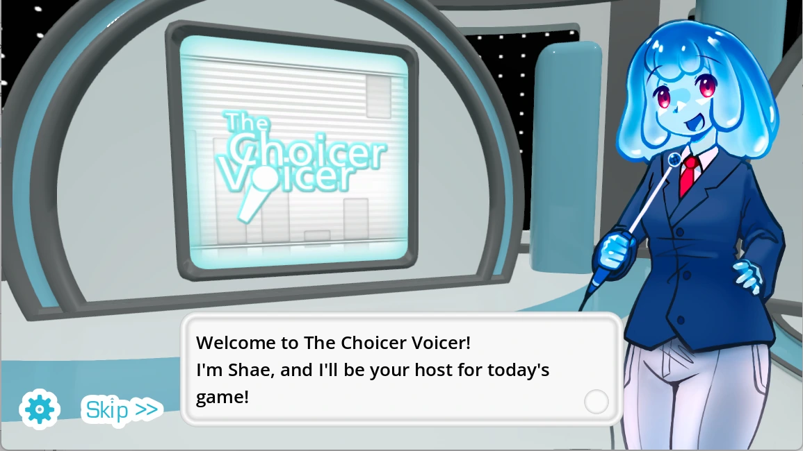
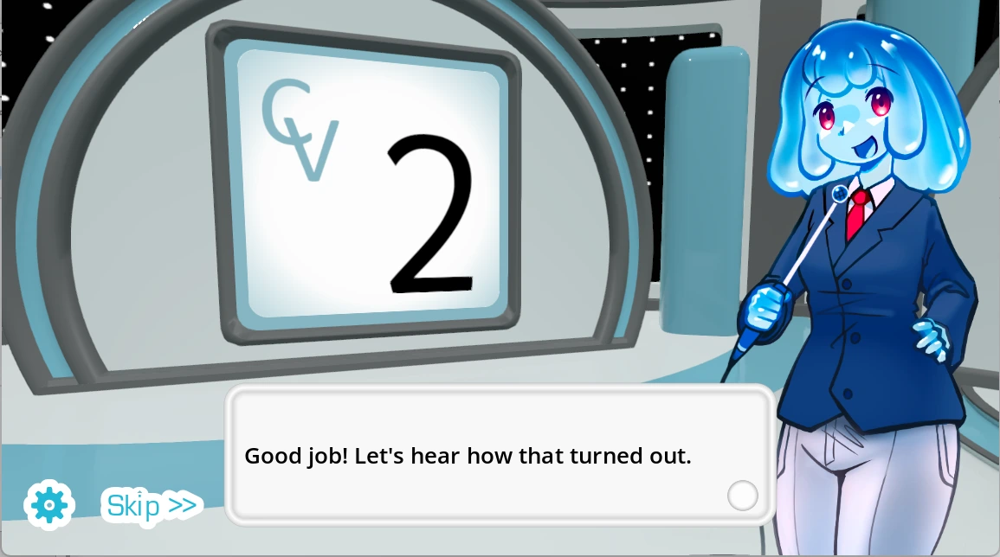
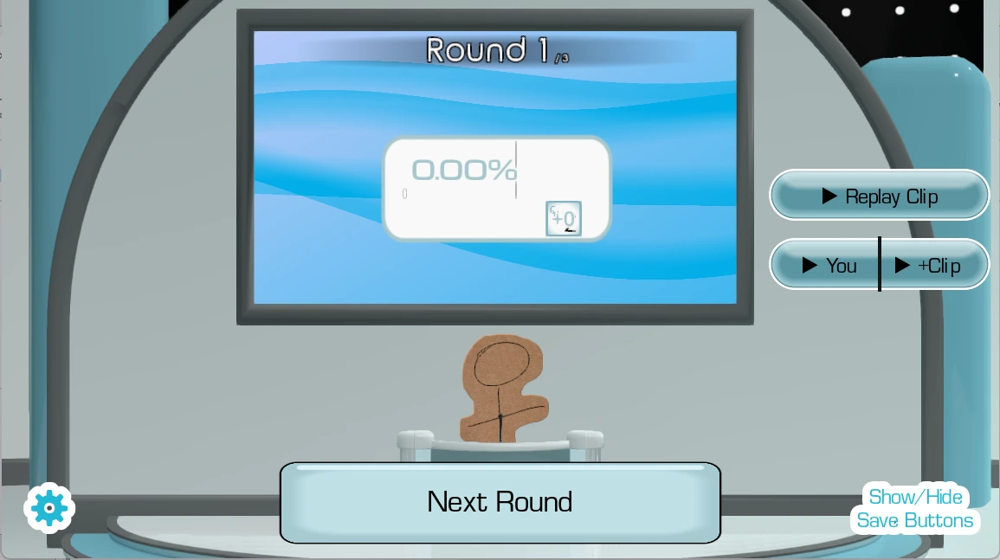

# The Choicer Voicer — Free Online Voice Party Game

**[Choicer Voicer Studio](https://choicervoicer.site/)** is a free browser portal for **The Choicer Voicer**, a microphone-powered party game where every prompt becomes a tiny performance. It also includes a dedicated **[Temple of the Jackal](https://choicervoicer.site/temple-of-the-jackal/)** page for adult players, with a restored 18-room rotation puzzle build, videos, illustrated guidance, and an unofficial post-expedition discussion.

## Play online free

Visit **[https://choicervoicer.site/](https://choicervoicer.site/)** and select **Start The Choicer Voicer**. The iframe loads only after this deliberate action, keeping the initial page lighter and ensuring microphone access is requested in context. No account or separate installer is required by the portal.

For reliable microphone selection, playback, and fullscreen behavior, use a current desktop version of Chrome or Edge. Headphones help prevent game audio from feeding back into the microphone.

## How a round works

1. Allow microphone access for the embedded game.
2. Listen to the prompt and choose a delivery.
3. Perform the line, hear the playback, and continue to the next round.

The fun comes from commitment rather than perfect imitation. Players can change pace, pitch, character, or emphasis, and local groups can pass the microphone between performers.

## Temple of the Jackal

Adult visitors can open **[Temple of the Jackal](https://choicervoicer.site/temple-of-the-jackal/)** from the compact Play More shelf or the shared top menu. Its page includes an age-gated restored game frame, two gameplay videos, an illustrated spoiler-light strategy guide, nine FAQs, and an unofficial post-expedition discussion. The game contains explicit sexual content and nudity and is intended only for players aged 18 or older.

## Website features

- A centered, responsive 16:9 game player with a delayed launch cover.
- Share and fullscreen controls directly below the iframe.
- A compact **Play More** shelf linking The Choicer Voicer and Temple of the Jackal without sending visitors to another website.
- A scored Persona reading with three live traits, on-device history, native sharing, and downloadable PNG cards. Reading history is stored only in the visitor's browser and is not uploaded.
- An opt-in game event bridge for real 0–6 round scores, match totals, end events, and temporary playback or WAV download of the latest take.
- Pack 工作台支持本地波形分析，以及由用户主动触发的 Whisper 服务端转写；Dub 预览、社交画幅、派对轮次和麦克风测试仍以浏览器本地处理为主。
- Eight independent SEO guide routes with direct calls to the relevant tools.
- Two embedded gameplay videos, illustrated session guidance, FAQ content, and browser troubleshooting.
- Complete About Us, Privacy Policy, Contact, and Terms of Service pages.
- Canonical metadata, Open Graph data, a sitemap, robots rules, and structured game/FAQ data.
- Responsive advertising that keeps the game clear: a desktop native block or mobile 320×50 banner in the content flow, plus a deferred Social Bar after visitors leave the game area. Popunder advertising is not used.

The site is an unofficial fan-made portal. Game names, characters, artwork, code, and related assets remain the property of their respective owners.

## Technology

The website uses Next.js 15, React 19, TypeScript, and CSS. Next.js uses static export, producing an **out/** directory suitable for GitHub-based deployment and static hosting. Images are exported without a server-side optimizer, and routes use trailing slashes.

Pack 页面默认使用浏览器端多语言 Whisper ONNX 模型。用户明确启动后，浏览器从 Hugging Face 下载并缓存模型，优先使用 WebGPU，失败时回退到 WASM/CPU；所选媒体、时间戳和转写正文不上传服务器。`server/transcribe-worker/` 保留为未来云端订阅方案的接口，但当前前端不会调用；云端入口只记录不含自由文本或媒体信息的需求事件。

Anonymous traffic measurement loads once from **https://data.1back.link/js/app.js** with the canonical domain **choicervoicer.site**. The separately hosted iframe game uses **s.templeofthejackal.com** as its analytics domain, allowing the game path's referral report to show which parent websites link to or embed it when browsers provide a referrer.

## Local development

    npm install
    npm run dev

Quality checks:

    npm run lint
    npm run typecheck
    npm run build

## Preserve the deployment repository

The generated **out/** directory is designed to be its own Git repository. Use:

    npm run build-preserve-git

On the first run, the command creates **out/README.md**, initializes **out/.git**, switches to the **main** branch, and configures:

    https://github.com/mooyu-king/choicer-voicer.git

On later runs, it temporarily saves **out/.git** and **out/README.md**, clears stale **.next** and generated output, performs a fresh static export, and restores both entries unchanged. The command does not stage, commit, push, deploy, or alter production traffic.

After reviewing the generated files, publish explicitly from inside **out/** using the repository owner's normal Git workflow.

## Main structure

    src/app/                         App Router pages, metadata, policies, and styles
    src/components/GameStudio.tsx   Game launch, real score/recording events, sharing, fullscreen, and Play More shelf
    src/components/EndingDiscussion.tsx  Persona statistics and PNG share-card generation
    src/lib/site.ts                 Domain, navigation, and shared site data
    public/                         Logo, screenshots, robots.txt, and sitemap.xml
    scripts/build-preserve-git.mjs  Safe static-export builder
    out/                            Generated site and independent deployment repository

## 隐私

麦克风权限由浏览器控制，并在跨域游戏 iframe 中使用。评分回合的录音只用于当前页面的临时播放和下载，不会自动上传。Pack 工作台的波形分析同样留在本机；只有用户明确点击 `Transcribe with Whisper` 后，所选媒体才会经独立 Worker 发送给 OpenAI 生成文字与分段时间戳。比赛摘要和 Persona 计数可能保存在浏览器本地存储中，直至访客清除站点数据。详情参见正式的 **[Privacy Policy](https://choicervoicer.site/privacy/)**。

## Visit the studio

Ready to take the microphone? **[Play The Choicer Voicer online free at choicervoicer.site](https://choicervoicer.site/)**.
